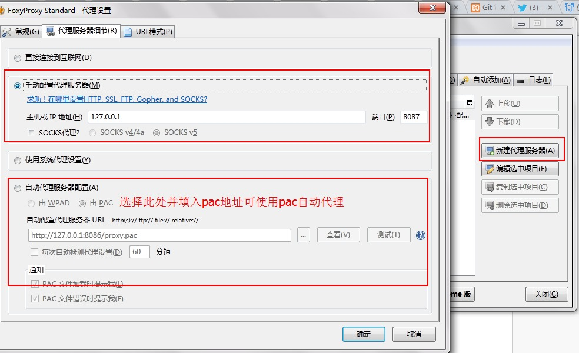
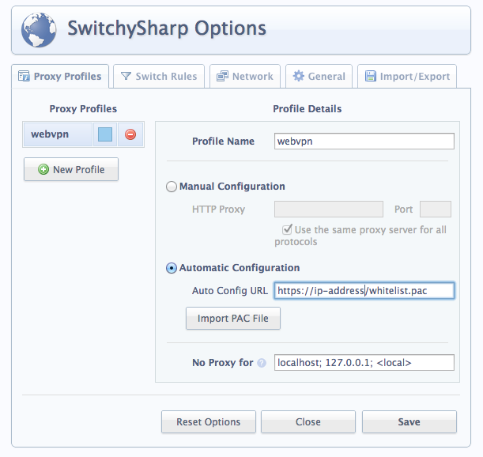
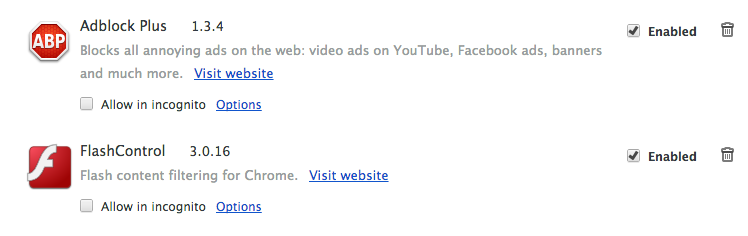

# GFW 白名单


概述
-----

著名的 [autoproxy.pac](https://autoproxy.org) (GFW List)  是一个 GFW 黑名单，访问名单中网站需要通过代理，不在名单中的网站直接访问。有效使用黑名单，维护者和用户都需要时常更新此名单，否则可能不能访问最近被墙的网站。这些不便之处是推广科学上网的阻碍之一。

白名单的方法是白名单中的网站不走代理，其它网站全部通过代理访问。白名单的优点是对维护的要求非常低。第一次安装后，即使很长时间不更新，也不会出现网站打不开的问题。当然，用户会要付出稍多一些流量。

事实上 GFW 的变化速度相当快，屏蔽的网站也越来越多，国外稍微有点意思的网站大都已经被墙，或者随时可能被墙。因此作者认为有必要开始维护一份白名单的 pac 文件。

本项目包含域名白名单与IP白名单，而最终生成的实用版本列表proxy.pac同时使用黑白名单，以便于更精确更高速地科学上网。推荐直接使用proxy.pac。

本列表的国内域名部分会由作者编写的Spider自动更新，提取出常用的大部分网站。如果需要其它格式的列表请联系作者。

简单使用方法
---------

###方法一：  
下载 whitelist.pac或whiteiplist.pac或proxy.pac 文件后，修改代理服务器的 ip 地址和代理类型。然后将浏览器的代理设置中指向 whitelist.pac或whiteiplist.pac。

	var wall_proxy = 'PROXY www.abc.com:443;'; 
	以上需要更换成有效的代理地址，代理类型还可以为'SOCKS5'或'HTTPS'
	多个代理之间使用分号分隔，如'PROXY a.com:80;SOCKS5 a.com:1080;'

当 `proxy` 的代理类型为 `HTTPS` 时，此 pac 文件适合用于 [Google Chrome 的安全代理](http://www.chromium.org/developers/design-documents/secure-web-proxy)。

对于不需要翻墙，但也需要代理的网站，可自行修改`nowall_proxy`，方式与`wall_proxy`相同。

###方法二：  
设置你的动态代理地址为：[http://proxy.breakwa11.ga/?proxy=SOCKS5_127.0.0.1:1080](http://proxy.breakwa11.ga/?proxy=SOCKS5_127.0.0.1:1080)  
如果你所在的地区使用IP匹配不合适，那么还可以使用这个地址：[http://proxy.breakwa11.ga/?style=noip&proxy=SOCKS5_127.0.0.1:1080](http://proxy.breakwa11.ga/?style=noip&proxy=SOCKS5_127.0.0.1:1080)  
注意proxy参数可修改为你自己本地的代理配置，这样即可下载一个适合你本地配置的pac文件。  
参数除了proxy，还支持：nowall, auto, ip, direct，分别对应：非翻墙代理，自动代理（默认与proxy一致），ip代理（默认与nowall一致），直连代理（如果没有必要请不要修改）。参数之间需加入&分隔开。参数解释：  
style: 列表类型。值为noip则不使用IP匹配，大多数情况下应该使用此值，除非你解决了DNS污染。  
proxy: 翻墙代理，GFW黑名单使用的代理  
nowall: 非翻墙代理，在白名单或国内IP中使用的代理  
direct: 直连代理，内网地址段使用的代理  
ip: ip代理，访问方式为使用IP而不使用域名的地址使用的代理（国内视频站多数为ip直连，所以默认与nowall一致）  
auto: 自动代理，均不在以上黑白名单也不是IP直连的情况下使用的代理。与proxy一致即白名单制，与nowall一致即黑名单制。

本功能在测试中，地址随时可能发生变化，访问速度可能很慢或访问不正常，如不能访问请留意本项目的变更。

本地代理使用 `PROXY` 即http代理最佳，兼容性最好，可用于IE或iOS自动代理配置，s5代理可使用privoxy转换为http代理。不过如果是远程代理可能被偷窥连接内容。


代码生成使用方法
---------

执行

main.py -o whitelist.pac -p "SOCKS5 127.0.0.1:1080; SOCKS 127.0.0.1080;"

所有选项均可忽略（直接不带参数执行也可），以上为默认值。至于whiteiplist.pac使用mainip.py生成。对于mainproxy.py执行：  
mainproxy.py -p "SOCKS5 127.0.0.1:1080;" -a "SOCKS5 127.0.0.1:1080; SOCKS 127.0.0.1:1080"

参数 -a 指定的是不匹配黑白名单的时候所使用的代理，一般使用与 -p 相同的代理即可。  
最后使用生成出来的 whitelist.pac或whiteiplist.pac或proxy.pac 即可  
自定义列表可把你的域名加入到lists/custom.py里，然后重新执行生成操作  
严重建议你把你的加入列表项通过mmgac001[at]gmail.com或者issues或者pull request告知我们

> 注：Safari浏览器不支持SOCKS5关键字，因此请再额外添加以"SOCKS"关键字开头的代理，IP与端口号不变

### SSH/Goagent/http 代理设置

谈一点题外话，不少网友通过 SSH(Tunnelier/Entunnel) 等本地 socks5 代理或者 goagent 等本地 http 代理来翻墙。

假设 SSH 开的本地S5端口是 7070，goagent 的本地端口开在 8087，那么设置wall_proxy为：


	'SOCKS5 127.0.0.1:7070; SOCKS 127.0.0.1:7070';
或

	'PROXY 127.0.0.1:8087';

然后只需要将whitelist.pac文件所在地址，直接复制到填写自动代理配置的地方（见下文图），就可以用上这个白名单了。如果是本地文件，填写路径类似于"file:///d:/whitelist.pac"。

### Load-Balance 多代理负载均衡设置

在生成好的whitelist.pac 中会有三个代理地址，将 `wall_proxy_1` 和 `wall_proxy_2` 修改为你的其他代理地址然后把 `okToLoadBalance` 设置为 `true` 即可多代理负载均衡。
目前是三个代理权重4\3\3，每次打开链接会随机挑选路由。


Firefox 代理
-----------

安装插件[foxyproxy](https://addons.mozilla.org/zh-cn/firefox/addon/foxyproxy-standard/)




Google Chrome 代理
-----------

安装插件SwitchySharp



Google Chrome 安全代理 （SSL Secure Proxy）
-----------

Google Chrome 已经支持基于 https 和 SPDY 的安全代理。其原理和效果与 SSH，shadowsocks 以及 goagent 类似：

* 将普通流量封装在加密通道之中，这样 GFW 就看不见流量的内容；
* 域名的解析在代理服务器这端完成，所以本地不用担心域名污染的问题。配合 pac 的使用，可以享受国内 CDN 的服务。达到一次设置完全免维护；
* 本地不从服务器端取得 ip，只适合浏览器内的应用，不适合 VoIP，网络游戏等应用。

优点有：

* 在 PC 和 Mac 上 Chrome 已经原生支持，不需要依赖额外的客户端；
* 封装的协议是 https 或 SPDY，GFW 完全没有 DPI 识别的可能，这是翻墙终极方案的一部分；
* 由 Google 支持，客户端和服务器端的软件成熟并且稳定，未来更新也可靠。

现有的缺点有：

* 暂时只适用于 PC 和 Mac 上的 Chrome。 Android 的客户端有待开发。iOS 客户端的可行性暂时还不清楚。

***有兴趣开发客户端的同学，可以考虑编译封装 @tatsuhiro-t 的 C 程序库 [spdylay](https://github.com/tatsuhiro-t/spdylay) 。***

```
shrpx --client-proxy [-b <HOST,PORT>] [-f <HOST,PORT>] 
				   [OPTIONS...] [<PRIVATE_KEY> <CERT>]
```

注意事项
----------------
使用whiteiplist.pac或proxy.pac时，你需要确认你已经解决DNS污染的问题。虽然代码中有对DNS污染做了一定的检测，但并不保证能解决所有运营商的DNS劫持。如果你的网络环境有较严重的DNS劫持影响到实际使用效果，那么建议使用whitelist.pac，或使用[dnscrypt](https://www.opendns.com/about/innovations/dnscrypt/)。

其它节省流量的方法
----------------

由于白名单的流量消耗较黑名单要高一些，在浏览器中安装下面的扩展，在提高网页浏览速度的同时，也能节省不少流量。

##### 屏蔽广告： Adblock Plus ＋ Easylist ＋ Chinalist

在 Firefox 或 Chrome 中安装 [Adblock Plus](http://adblockplus.org/en/) (ABP) 扩展，并在 ABP 的控制面板中加入 Easylist 和 [Chinalist](http://code.google.com/p/adblock-chinalist/)。这样可以有效的过滤广告大部分网站和网页。

`注意`：下载扩展和 ChinaList 的时候可能需要打开全局翻墙的 VPN 。

##### 屏蔽Flash： FlashControl 或 FlashBlock

在 Chrome 中安装 [FlashControl](https://chrome.google.com/webstore/detail/flashcontrol/mfidmkgnfgnkihnjeklbekckimkipmoe) 或在 Firefox 中安装 [FlashBlock](https://addons.mozilla.org/zh-cn/firefox/addon/flashblock/)，可以达到屏蔽 Flash 的效果。需要打开 Flash，比如视频，只要在被屏蔽的 Flash 上点击一次。



PAC性能（100,000次重复执行）
----------------
firefox  
whitelist.pac 62ms  
whiteiplist.pac 77ms  
proxy.pac 160ms

chrome  
whitelist.pac 94ms  
whiteiplist.pac 80ms  
proxy.pac 308ms

IE9  
whitelist.pac 96ms  
whiteiplist.pac 160ms  
proxy.pac 349ms

safari  
whitelist.pac 196ms  
whiteiplist.pac 155ms  
proxy.pac 552ms

base on  
[n0wa11 gfw_whitelist](https://github.com/n0wa11/gfw_whitelist)  
[clowwindy gfwlist2pac](https://github.com/clowwindy/gfwlist2pac)  
[Leask Flora_Pac](https://github.com/Leask/Flora_Pac)

```
任何意见或建议，请联系 mmgac001[at]gmail.com ，或提交issue到项目页面 ლ(╹◡╹ლ)
```
